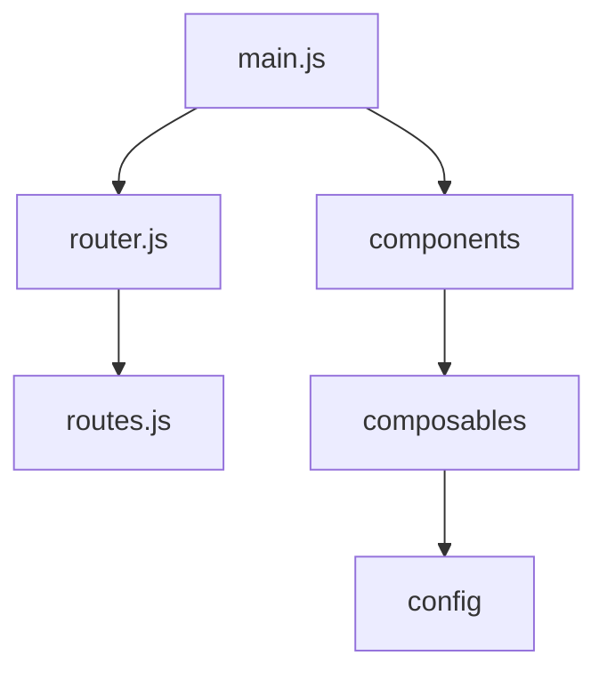

# Code Map

```mermaid
graph TD;
  main[main.js] --> router[router.js];
  router --> routes[routes.js];
  main --> components;
  components --> composables;
  composables --> config;
```

This Mermaid diagram sketches the primary runtime relationships. Components import composables for logic, which in turn depend on configuration modules such as Supabase.
